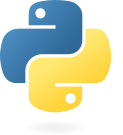

# **Mes travaux**
> ## **Formations**

[Formations Technique de bases du développement d'application, Développeur Intégrateur Web et Full-stack](https://github.com/MiKL5/afpaDev)  

[Projet avec Symfony (en fromaiton Développeur Full-stack)](https://github.com/MiKL5/afpaDevSymfony)  

### Formation Concepteur Développeur d'Application  

[Méthodes Agiles](https://github.com/MiKL5/afpaCDA/tree/master/methodeAgile "Les méthodes Agiles")  

[Projet (fil rouge) de la formation CDA](https://github.com/MiKL5/greenMusic)
___
> ## **Autres apprentissages** 

> ### **[Jeu Snake en Javascript](https://mikl5.github.io/Snake/)**  
___
> ### **[Auto-formation au bases de Python](https://github.com/MiKL5/Python)** 

**[Bases de Python](https://github.com/MiKL5/Python)**   

Mini-projet 1 : [Calculateur de revenu](https://github.com/MiKL5/Python/blob/master/miniProjet)  
Mini-projet 2 : [Fizz Buzz](https://github.com/MiKL5/Python/blob/master/FizzBuzz)  
Mini-projet 2 : [Budjet des films](https://github.com/MiKL5/Python/blob/master/filmBudgets)  

___
> ### **[Apprentissage de React](https://github.com/MiKL5/React)** 
[Apprentissage de React](https://github.com/MiKL5/React)  
[Projet 1 : To do list](https://mikl5.github.io/reactTodoList/)  